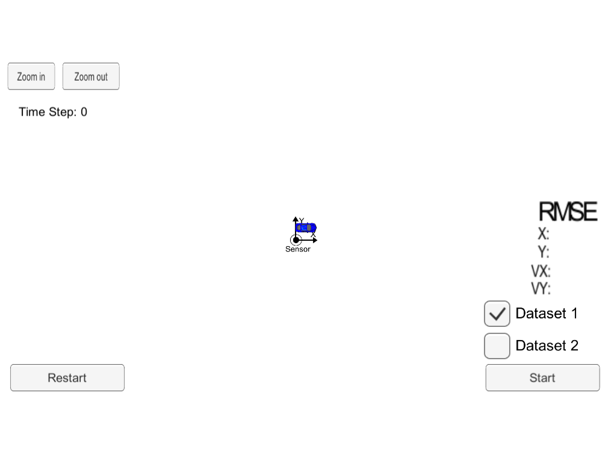
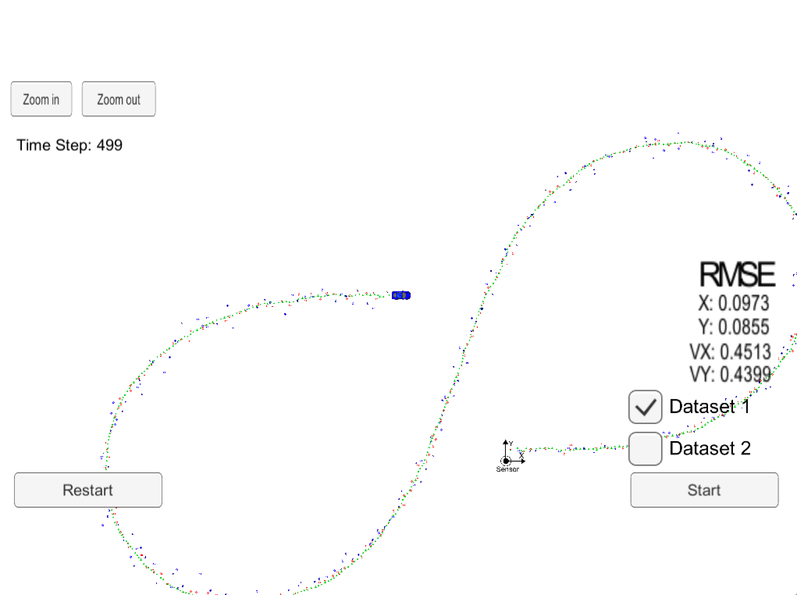
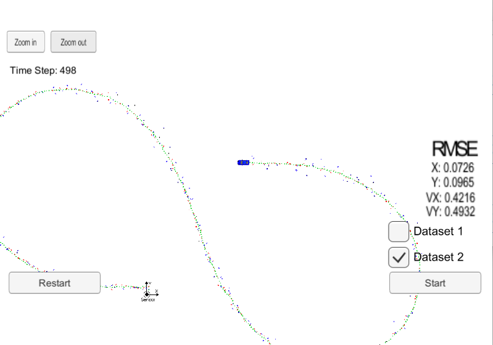

# Self-Driving Car Extended Kalman Filter -  Part 1
Udacity Self-Driving Car Nanodegree - Extended Kalman Filter Implementation test

# Overview
This project implement an Extended Kalman Filter in Self-driving car to track and predict the position of objects around the vehicle. In this object, the EKF system use two sensors data from RADAR and LIDAR measurement for processing EKF. This project used C++ as a programming language because it perform fast and can decrectly interact with the sensors hardware.

# Prerequisites

The project has the following dependencies (from Udacity's seed project):

- cmake >= 3.5
- make >= 4.1
- gcc/g++ >= 5.4
- Udacity's simulator.


For instructions on how to install these components on different operating systems, please, visit [Udacity's seed project](https://github.com/udacity/CarND-Extended-Kalman-Filter-Project). As this particular implementation was done on Mac OS, the rest of this documentation will be focused on Mac OS.

In order to install the necessary libraries, use the [install-mac.sh](./install-mac.sh).

# Compiling and executing the project

These are the suggested steps:

- Clone the repo and cd to it on a Terminal.
- Create the build directory: `mkdir build`
- `cd build`
- `cmake ..`
- `make`: This will create two executables
  - `ExtendedKF` : EKF implementation.
 

## Running the Filter

From the build directory, execute `./ExtendedKF`. The output should be:

```
Listening to port 4567
Connected!!!
```

As you can see, the simulator connect to it right away.

The following is an image of the simulator:

<kbd>

</kbd>

The simulator provides two datasets. The difference between them are:

- The direction the car (the object) is moving.
- The order the first measurement is sent to the EKF. On dataset 1, the LIDAR measurement is sent first. On the dataset 2, the RADAR measurement is sent first.

Here is the simulator final state after running the EKL with dataset 1:

<kbd>

</kbd>

Here is the simulator final state after running the EKL with dataset 2:

<kbd>

</kbd>

# [Rubric](https://review.udacity.com/#!/rubrics/748/view) points

## Compiling

### Your code should compile

The code compiles without errors. I think the code should be compatible with other platforms, but I only test it on Mac OS.

## Accuracy

### px, py, vx, vy output coordinates must have an RMSE <= [.11, .11, 0.52, 0.52] when using the file: "obj_pose-laser-radar-synthetic-input.txt which is the same data file the simulator uses for Dataset 1"

The EKF accuracy was:

- Dataset 1 : RMSE <= [0.0973, 0.0855, 0.4513, 0.4399]
- Dataset 2 : RMSE <= [0.0726, 0.0965, 0.4216, 0.4932]

## Following the Correct Algorithm

### Your Sensor Fusion algorithm follows the general processing flow as taught in the preceding lessons.

The Kalman filter implementation can be found [src/kalman_filter.cpp](./src/kalman_filter.cpp) and it is used to predict at [src/FusionEKF.cpp](./src/kalman_filter.cpp#L147) line 147 and to update line 159 to 169.

### Your Kalman Filter algorithm handles the first measurements appropriately.

The first measurement is handled at [src/FusionEKF.cpp](./src/kalman_filter.cpp#L61) from line 61 to line 107.

### Your Kalman Filter algorithm first predicts then updates.

The predict operation could be found at [src/FusionEKF.cpp](./src/kalman_filter.cpp#L147) line 147 and the update operation from line 159 to 169 of the same file.

### Your Kalman Filter can handle radar and lidar measurements.

Different type of measurements are handled in two places in [src/FusionEKF.cpp](./src/kalman_filter.cpp):

- For the first measurement from line 61 to line 107.
- For the update part from line 159 to 169.

## Code Efficiency

### Your algorithm should avoid unnecessary calculations.

An example of this calculation optimization is when the Q matrix is calculated [src/FusionEKF.cpp](./src/kalman_filter.cpp#L141) line 135 to line 144.
